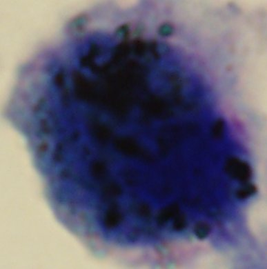
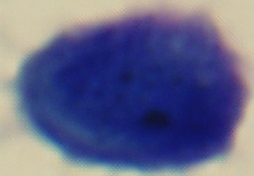
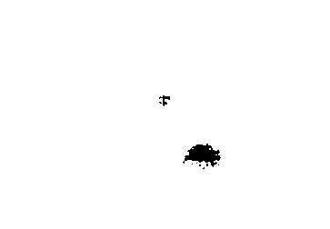

# Phansalkar Threshold Method in C++

The *Phansalkar* method is described in **[Adaptive local thresholding for detection of nuclei in diversity stained cytology images](./daptive Local Thresholding for Detection of Nuclei in Diversity Stained Cytology Images .pdf)**, is also an  [Auto Local Threshold plugin](https://imagej.net/Auto_Local_Threshold) in ImageJ.

Using the *Phansalkar* method to segment carbon black particles in cytology images:

1. First, split original image into three channels(R, G, B).

2. Blue Channel image which is easier to be segmented as input for  the *Phansalkar* method.

3. The segment effect is as follows:

   * high density

     

     ")

   * low density

Reference:

* https://www.researchgate.net/publication/224226466_Adaptive_local_thresholding_for_detection_of_nuclei_in_diversity_stained_cytology_images

* https://github.com/fiji/Auto_Local_Threshold/blob/master/src/main/java/fiji/threshold/Auto_Local_Threshold.java

* https://stackoverflow.com/questions/11456565/opencv-mean-sd-filter